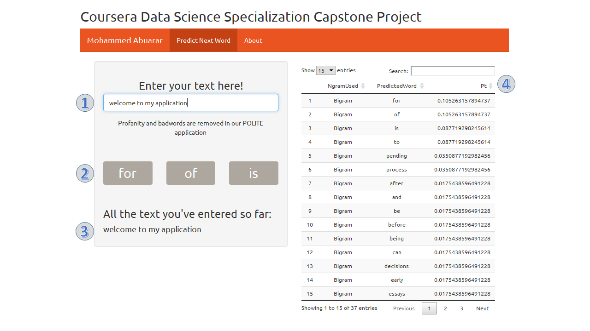

# Coursera's Data Science Specialization Capstone Project

### **Introduction to Objectives of the Capstone Project:**

This application is submitted as **Coursera**'s Data Science Specialization Capstone Project given by **[Johns Hopkins University](https://www.jhu.edu/)** instructors: **[Jeff Leek](https://www.coursera.org/instructor/~694443)**,  **[Roger D. Peng](https://www.coursera.org/instructor/rdpeng)** and  **[Brian Caffo](https://www.coursera.org/instructor/~688901)** who are professors in **[Bloomberg School of Public Health](https://www.jhsph.edu/)**
the main target of this capstone project is to practice the knowledge and skills we've learned through previous 9 courses in the specialization with a real life task.

In cooperation with **[SwiftKey](https://www.microsoft.com/en-us/swiftkey/about-us)** which is a leading predictive text input company, the capstone project introduced a challenge to make a word prediction algorithm using text data from a corpus called **[HC Corpora](http://corpora.epizy.com/about.html)**, and by applying data science in the area of **[natural language processing](https://en.wikipedia.org/wiki/Natural_language_processing)**.

### **Tasks to be accomplished and problems to be solved:**

Getting and cleaning the data was the first task, and  mainly accomplished by **[tidytext package](https://github.com/juliasilge/tidytext)** which did also **[tokenizing](https://en.wikipedia.org/wiki/Lexical_analysis#Tokenization)** text into **[ngrams: Quadgram, Trigram and Bigram](https://en.wikipedia.org/wiki/N-gram)** which is **natural language processing** commonly used method.

Exploratory analysis showed that the text has a statistical distribution that comes with very long tails (many words that occur rarely) and (fewer words that occur frequently) which is a common criterion in text data. This criterion will help to represent data fairly by taking a small sample compared to the the very large corpus, and this step will solve the performance vs accuracy tradeoff to achieve a good mix of both (higher performance with an acceptable accuracy) which will make the application speed practical on mobile smart phones.
**[Check my Milestone Report](https://htmlpreview.github.io/?https://github.com/abuarar/Coursera-s-Data-Science-Specialization-Capstone-Project/blob/master/Peer-graded%20Assignment%20(Milestone%20Report)/Peer-graded_Assignment__Milestone_Report_.html
)**

In my prediction model I used katz back-off smoothing technique to include the many unseen ngrams by reverting back to (n-1)grams and redistributing probabilities from low frequency ngrams to unseen (n-1)grams, so the algorithm will work in the following way:

* If the input text last 3-words match starting 3-words within Quadgram, the 4th-word is the prediction, (QuadgramBackoff will include unseen 4th-word as well).
* If above is not, and only the last 2-words match starting 2-words within Trigram, the 3rd-word is the prediction, (TrigramBackoff will include unseen 3rd-word as well).
* If above is not, and only the last word match starting 1-word within Bigram, the 2nd-word is the prediction.

### Application Quick Tutorial:

1. Your text input which can be entered via keyboard
2. This is both a **Display** for most 3 probable predicted word (in case 3 or more predictions are available), and also an interactive **Clickable Button** to add predicted text once you click it to already entered previous text (**same as in swiftkey application**).
3. This is the total text you've entered so far.
4. This is a data table of the predicted next words, with Ngram used and Probability (**[Pt: Turing probability in katz backoff model](http://l2r.cs.uiuc.edu/~danr/Teaching/CS546-09/Papers/Katz87.pdf)**)

##### **Mohammed Abuarar**

##### **March 12, 2019**

